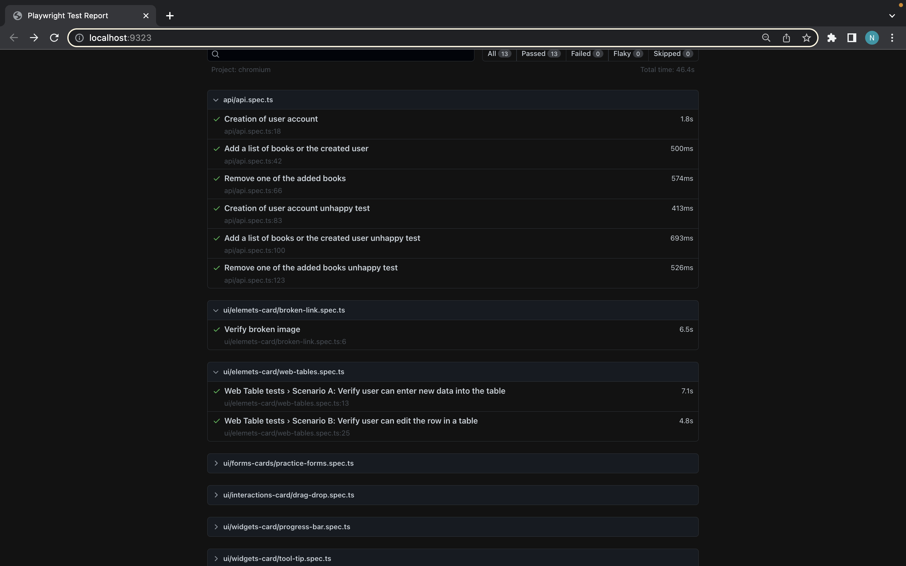

# Playwright-Automation


## Table Of Contents
* [Introduction](#Introduction)
* [Installation](#Installation )
* [Project Structure ](#Project-Structure)
* [Commands  ](#Commands)
* [Sample report View  ](#Sample-Report-View)
## Introduction 
This project focuses on automating end-to-end test cases using Playwright and TypeScript, following the Page Object Model design pattern. The comprehensive approach covers both API and UI testing.

## Installation
To set up VS Code for working with Playwright, you'll need the following prerequisites:

* Node.js
* Visual Studio Code (VS Code)
* To install Playwright open the terminal and run the command: 
```
$ npm init playwright@latest
```
It will ask a few series of questions like which language to use, which end-to-end directory to use etc. Select as per requirement.

Below files will get added.
* playwright.config.ts
* package.json
* package-lock.json
* tests/
  example.spec.ts
* tests-examples/
  demo-todo-app.spec.ts

## Project-Structure 

* **e2e** : Working directory 
  * **api/ api-basic.ts** : Methods for token generation and Authorization
  * **api/ api-spec.ts** : Test for APIs test cases
  * **page/ pageAsPerCardsFolder / locatorsOfRespectivePages/ filesAsPerPanelContent** : Pages folder for respective cards
  * **ui/ folderPercards/ filesForSpecificTests** : Test files for respective pages for UI test cases
  * **uploads** : To store the files to upload in tests
* **test-results** : Report of test run

## Commands 
* To run tests from the scripts
  * npm run keyFromTheScripts

```
$ npm run all
$ npm run testapi
$ npm run testui
```

* To run a test from a specific file / specific title

```
$ TEST_TITLE="Title/file name of the test" npm run test:specific
```

## Sample-Report-View

